

# Hello 👋, I'm Lakshmi
### Passionate 🤖 Machine Learning Engineer

 

<!-- Kaggle Stats Cards Row -->

  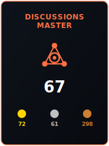
  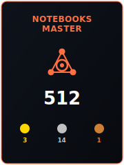
  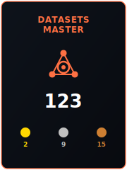
  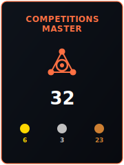

<!-- Quick Connections / Badges -->

  
  
  
  
  

  

---

## 🛠️ Expertise & Technical Skills

  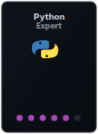
  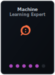
  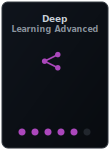
  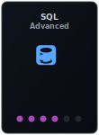
  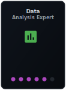
  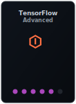
  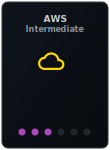
  

---

## 💻 Featured Projects

  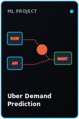
  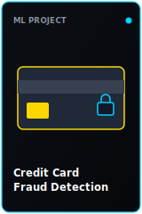
  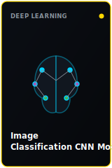
   
  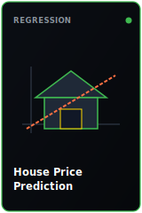
  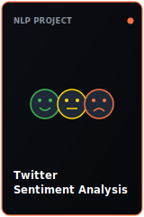
  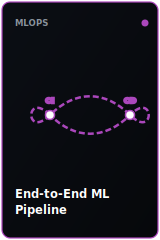

---

* 📩 **How to reach me**: [lakshmi.mk@gmail.com](mailto:lakshmi.mk@gmail.com)
* ⚡ *I love building ML solutions and contributing to Open Source.*
* 🌱 *Currently exploring MLOps, Deep Learning, and LLMs.*

