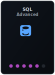
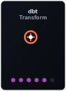
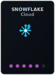
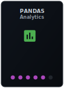
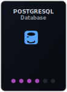
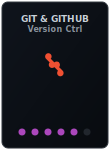
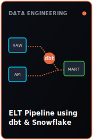
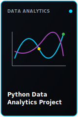

<div align="center">

# Hi there 👋 I'm Lakshmi

### BCA Student at BMS College for Women
### Aspiring Data Engineer & Data Analyst

```md
SQL • Python • dbt • Snowflake • Data Analytics
```

---

<!-- Quick Connections / Badges -->
<p align="center">
  <a href="mailto:lakshmimk03.work@gmail.com"></a>
  <a href="https://linkedin.com/in/lakshmi-mk-work"></a>
  
  
</p>

---

## 🛠️ Expertise & Technical Skills

<p align="center">
  
  
  
  
  
  
  
</p>

---

## 💻 Featured Projects

<p align="center">
  
  
</p>

<table align="center" width="90%">
  <tr>
    <td width="50%" valign="top">
      <h4>🔹 ELT Pipeline using dbt & Snowflake</h4>
      <ul>
        <li>Designed staging, intermediate, and data mart models to transform raw datasets.</li>
        <li>Implemented automated transformation logic and data quality tests in <b>dbt</b>.</li>
        <li>Loaded transformed data structures into <b>Snowflake</b> warehouses for reporting.</li>
      </ul>
    </td>
    <td width="50%" valign="top">
      <h4>🔹 Python Data Analytics Project</h4>
      <ul>
        <li>Conducted Exploratory Data Analysis (EDA) on customer & sales datasets.</li>
        <li>Built comprehensive data visualizations using <b>Pandas</b>, <b>NumPy</b>, and <b>Seaborn</b>.</li>
        <li>Extracted actionable business trends and revenue patterns.</li>
      </ul>
    </td>
  </tr>
</table>

---

## 🏆 Achievements & Certifications

<table align="center" width="90%">
  <tr>
    <td width="50%" valign="top">
      <h4>🏆 Hackathons</h4>
      <ul>
        <li><b>Top 10 Finalist</b> – Indegene Hackathon</li>
      </ul>
    </td>
    <td width="50%" valign="top">
      <h4>📜 Certifications</h4>
      <ul>
        <li><b>Data Engineering Career Track</b> – Springboard</li>
        <li><b>Python Programming Certificate</b> – Springboard</li>
      </ul>
    </td>
  </tr>
</table>

---

## 📈 Real-Time GitHub Analytics

<p align="center">
  
  <br />
  
</p>

---

## 📫 How to Reach Me
* 📧 Email: **lakshmimk03.work@gmail.com**
* 🔗 LinkedIn: **[linkedin.com/in/lakshmi-mk-work](https://linkedin.com/in/lakshmi-mk-work)**
* ⚡ *“Turning raw numbers into data pipelines and business intelligence.”*

</div>
